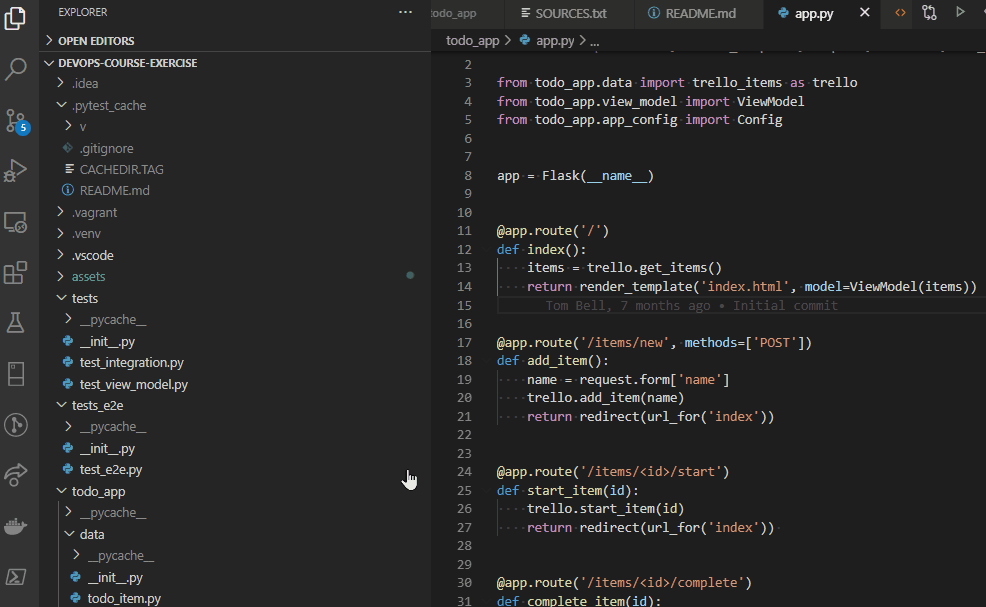
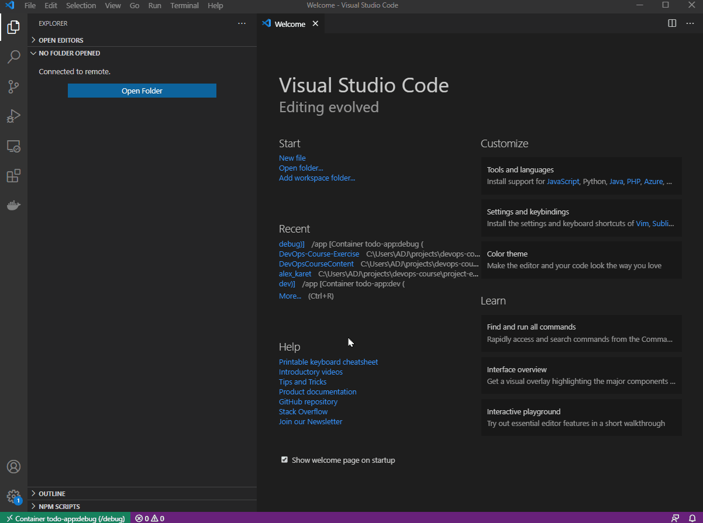

# DevOps Apprenticeship: Project Exercise

## System Requirements

The project uses poetry for Python to create an isolated environment and manage package dependencies. To prepare your system, ensure you have an official distribution of Python version 3.7+ and install poetry using one of the following commands (as instructed by the [poetry documentation](https://python-poetry.org/docs/#system-requirements)):

### Poetry installation (Bash)

```bash
curl -sSL https://raw.githubusercontent.com/python-poetry/poetry/master/get-poetry.py | python
```

### Poetry installation (PowerShell)

```powershell
(Invoke-WebRequest -Uri https://raw.githubusercontent.com/python-poetry/poetry/master/get-poetry.py -UseBasicParsing).Content | python
```

## Pre-requisites 

You'll need to have a [Trello](https://trello.com/) account and an API key/token pair to setup this app. Details on how to obtain these can be found [here](https://developer.atlassian.com/cloud/trello/guides/rest-api/api-introduction/).

You'll also want to have a Trello board setup for your todos with 3 lists with the following names:
* To Do
* Doing
* Done

You'll also want to have your board id to hand. See [here](https://developer.atlassian.com/cloud/trello/guides/rest-api/api-introduction/#boards) on how to locate your board id.

## Dependencies

The project uses a virtual environment to isolate package dependencies. To create the virtual environment and install required packages, run the following from your preferred shell:

```bash
$ poetry install
```

You'll also need to clone a new `.env` file from the `.env.template` to store local configuration options. This is a one-time operation on first setup:

```bash
$ cp .env.template .env  # (first time only)
```

The `.env` file is used by flask to set environment variables when running `flask run`. This enables things like development mode (which also enables features like hot reloading when you make a file change). 

You also want to fill in the values for your Trello API key, token and board (see the prerequisites section above)

## Running the App

Once the all dependencies have been installed, start the Flask app in development mode within the poetry environment by running:
```bash
$ poetry run flask run
```

You should see output similar to the following:
```bash
 * Serving Flask app "app" (lazy loading)
 * Environment: development
 * Debug mode: on
 * Running on http://127.0.0.1:5000/ (Press CTRL+C to quit)
 * Restarting with fsevents reloader
 * Debugger is active!
 * Debugger PIN: 226-556-590
```
Now visit [`http://localhost:5000/`](http://localhost:5000/) in your web browser to view the app.

## Running the Tests

Tests can be run as a whole by running `poetry run pytest`. To skip the slow end to end tests, you can run `poetry run pytest tests`.

To run the tests individually in vscode run `>Python: Discover Tests` from the command window (`Ctrl/Cmd + Shift + P`), select `pytest` as the test runner and then `.` as the test folder.
* To get the end to end tests running you'll need to [download the applicable chromedriver](https://chromedriver.chromium.org/downloads) for your version of Chrome + OS and add it the project root folder or your PATH.
* We'd recommend installing the [Python Test Explorer](https://marketplace.visualstudio.com/items?itemName=LittleFoxTeam.vscode-python-test-adapter) extension for VSCode as it doesn't have issues like all the tests vanishing when one file has a syntax error (plus it's easier to view individual test log output).

### Vagrant

This project supports vagrant, a VM-based alternative to running development code locally. To install vagrant, follow the instructions [here](https://www.vagrantup.com/docs/installation). You will require an appropriate hypervisor - we recommend virtualbox.

To launch the VM, run `vagrant up` in the repository root. First-time setup will take a few minutes. Once complete, the production app will be available at [`http://localhost:5000/`](http://localhost:5000/).

### Docker

This project is configured to run in Docker, and contains separate build steps for local development and production images.

#### Local

```bash
$ docker build --target development --tag todo-app:dev .
$ docker run --env-file ./.env -p 5100:80 --mount type=bind,source="$(pwd)"/todo_app,target=/app/todo_app --name dev todo-app:dev
```

The local development image mounts the app source code directly from the host, and will hot reload on changes without requiring a reload or rebuild. Do not use this image in production.

Alternatively, you can use docker compose to build and launch the local development image:

```bash
$ docker-compose up --build
```

#### Production

```bash
$ docker build --target production --tag todo-app:prod .
$ docker run -p 5100:80 todo-app:prod
```

The production environment must include the environment variables defined in `.env.template`. To test a production image locally, add the `--env-file ./.env` argument to `docker run`.

#### Debug

To run the container in debugging mode first launch the debug container:

```bash
$ docker-compose -f docker-compose-debug.yml up --detach --build
```

Next you'll want to make sure you have both the *Docker* & *Remote Developement* extensions for VScode installed.

With these installed select the docker icon from the activity bar to find your container. Right click on it and select *Attach Visual Studio Code*:



From here a new VSCode window should open. From here select the Explore from the activity bar (Ctrl/Cmd + E) which should now show a large button saying open folder. After clicking this button a drop down should appear where you can enter the app folder:



Note you may need to install the Python extension inside the container to enable basic features like adding breakpoints.

From here you can debug the app as usual, selecting Run => Start Debugging => Flask and then enter the app name (`todo_app/app.py`).

#### Testing

The end-to-end tests require live trello API credentials, which can be supplied via a `.env` file or set manually as the environment variables `TRELLO_API_KEY` and `TRELLO_API_SECRET`.

You can run tests without docker by executing pytest directly:

```bash
$ poetry run pytest tests
$ poetry run pytest tests_e2e
```
